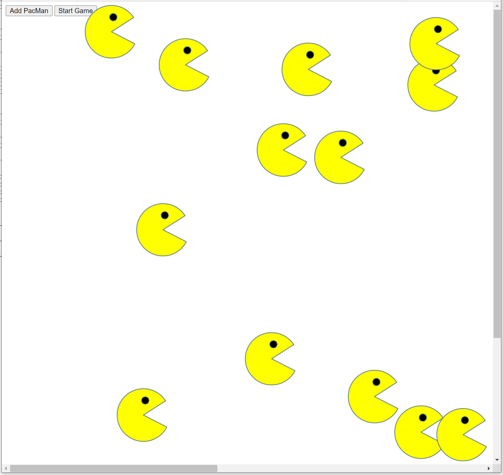

# PacMen-On-Fly

### **Description**: Week 07: Working With The DOM to Add Animation to the web page

Demonstrate web application using JavaScript, HTML, CSS, and create animation:

<ul>
  <li>HTML: div, button, img element</li>
  <li>Stylesheet: class</li>
  <li>JavaScript:
    <ul>
      <li>manipulating the <b>img</b> tag style attributes</li>
      <li>using array</li>
      <li>Calling Timer: setTimeout()</li>
  </li>
</ul>

### **Installation**:
<ul><li>Fork the repository</li></ul>

### **Usage**:
<ul>
	<li>Load index.html on your internet browser</li>
	<li>Click on Start Game button</li>
	<li>Click on Add PacMan button (many clicks as you like)</li>
	<li>To stop the animation, close your internet browser</li>
</ul>

### **Support**:
<ul><li>None.</li></ul>

### **Roadmap**:
<ul>
  <li>Currently using only one image: ./images/PacMan1.png</li>
  <li>Future: will use other images to animate the PacMan's mouth shut-and-open</li>
  <li>Future: will use appropriates images to animate the PacMan's moving left or right</li>
</ul>

### **License information**:
<ul>
  <li>Some provided materials from the lecture videos and from assignment solutions are used in this project</li>
  <li>Some implementations are derived from the provided materials of the course:
    <ul>
      <li>index.html</li>
      <li>images/PacMan1.png, PacMan2.png, PacMan3.png, PacMan4.png</li>
    </ul>
  </li>
</ul>
